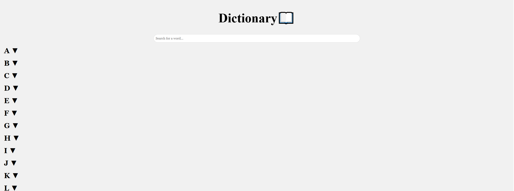
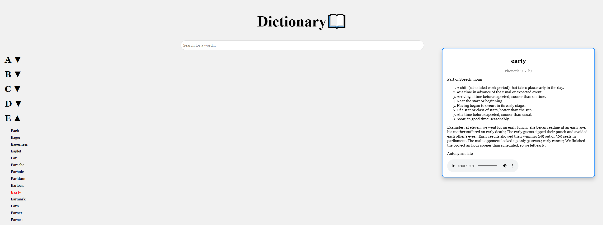
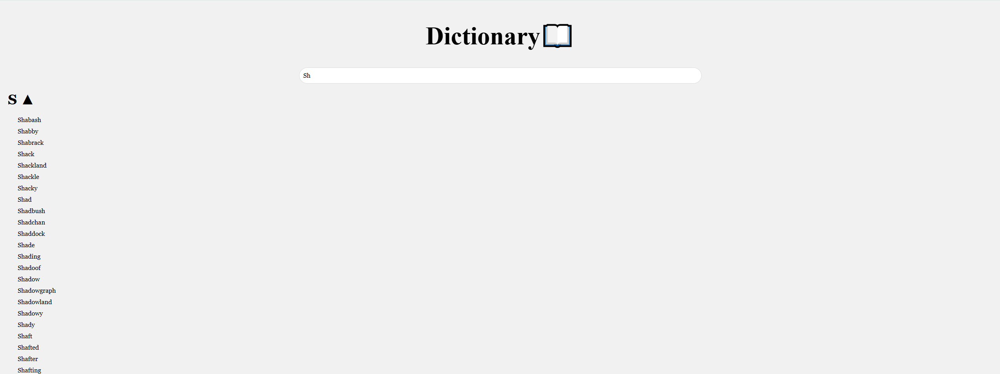

# interactive-dictionary
An interactive dictionary that shows a word's definitions, phonetics, and some example sentences when hovered over provided by an API. Includes a searching feauture that uses binary-search to find words that match user input and displays them.

**Link to project:** https://interactive-dictionary-1.onrender.com/

## How It's Made
Tech used: HTML, CSS, JavaScript, Python, Flask, API

The project uses Flask to serve the backend and HTML/CSS/JavaScript to build the frontend. On startup, the backend reads a large list of words from words.txt and organizes them alphabetically. These words are then displayed on the website grouped by their starting letter.

When a user hovers over any word, a JavaScript event is triggered that sends the word to a dictionary API which returns the word’s definitions, phonetics, and example sentences. The frontend then displays the information returned by the API on a panel to the right for the user to read.

Additionally, the site features a live search functionality. When a user types something into the search bar, a JavaScript function dynamically filters the displayed list of words to show only the words that match the user's input.

